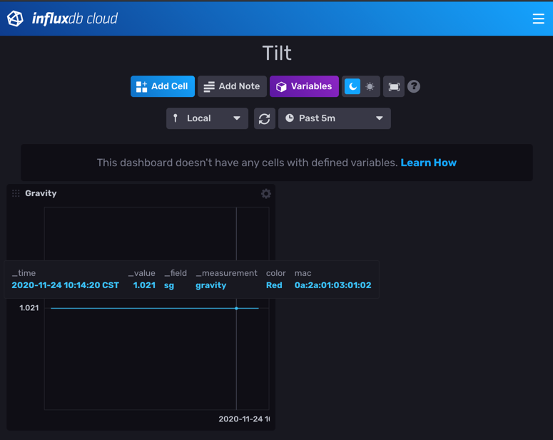

Tilty
=====

[](https://coveralls.io/github/myoung34/tilty)
[](https://pypi.python.org/pypi/Tilty/)
[](https://hub.docker.com/r/myoung34/tilty)




A python module and CLI to capture and emit events from your [tilt hydrometer](https://tilthydrometer.com/)

I've been unhappy with the quality/inconsistency of what I've seen out there in terms of random scripts that capture.
No tests, no pluggable emitters, hard to find, etc.

The tilt essentially broadcasts iBeacon packets to send out a uuid (which type of tilt it is), a major (the temp in F), and a minor (the specific gravity).

This will capture those whenever theyre transmitted and emit them to a backend of your choosing so that you can graph it over time asynchronously.

The Tilt supports writing to a google doc which you could use with something like IFTTT or Zapier, but this is much lighter and lets you decide how you want to push that out with a pluggable backend system.


## Supported Emitters ##

* stdout
* Webhooks
  * Generic (Send to any endpoint with any type)
  * Brewstat.us (Example below)
  * BrewersFriend (Example below)
* InfluxDB (1.8+)
* Datadog (dogstatsd)
* SQLite
* Google Sheets (experimental/advanced)
* Prometheus (via pushgateway)

## Usage ##

### Generate Config ###

```
$ cat <<EOF >config.ini
[general]
sleep_interval = 2 # defaults to 1
gravity_offset = -0.001 # subtract 0.001 gravity
temperature_offset = 3 # add 3 degrees
logging_level = DEBUG # defaults to INFO
logfile = /var/log/foo.log # defaults to stdout

# stdout example
[stdout]

[google]
# This is advanced. TODO: write up how to provide an access/refresh token
refresh_token = 11111111111111111111111111
client_id = 111111-1111.apps.googleusercontent.com
client_secret = 1111111111111111
spreadsheet_id = 1BxiMVs0XRA5nFMdKvBdBZjgmUUqptlbs74OgvE2upms

# SQLite example
[sqlite]
file = /etc/tilty/tilt.sqlite

# Generic application/json example
[webhook]
url = http://www.foo.com
headers = {"Content-Type": "application/json"}
payload_template = {"color": "{{ color }}", "gravity": {{ gravity }}, "mac": "{{ mac }}", "temp": {{ temp }}, "timestamp": "{{ timestamp }}"}
method = POST
delay_minutes = 1 # cause a minimum delay between webhook emits

# Brewstat.us example
[webhook]
url = https://www.brewstat.us/tilt/0yjRbGd2/log
headers = {"Content-Type": "application/x-www-form-urlencoded; charset=utf-8"}
payload_template = {"Color": "{{ color }}", "SG": {{ gravity }}, "Temp": {{ temp }}, "Timepoint": "{{ timestamp }}"}
method = POST

# Brewers Friend example
[webhook]
url = https://log.brewersfriend.com/tilt/3009ec67c6d81276185c90824951bd32bg
headers = {"Content-Type": "application/x-www-form-urlencoded"}
payload_template = {"SG": {{ gravity }}, "Temp": {{ temp }}, "Color": "{{ color }}"}
method = POST

# Brewfather custom stream example
[webhook]
url = https://log.brewfather.net/stream?id=aTHF9WlXKrAb1C
headers = {"Content-Type": "application/json"}
payload_template = {"name": "Tilt {{ color }}", "gravity": {{ gravity }}, "gravity_unit": "G", "temp": {{ temp }}, "temp_unit": "F"}
method = POST

[influxdb]
url = http://localhost:8086
verify_ssl = True # defaults to False, only used if url is https://
bucket = tilty
org = Mine
token = mytoken # if using influx cloud
token = myuser:password # if using self hosted
gravity_payload_template = gravity,color={{ color }},mac={{ mac }} sg={{ gravity }}
temperature_payload_template = temperature,color={{ color }},mac={{ mac }} temp={{ temp }}

[datadog]
# Note: make sure that the dd agent has DD_DOGSTATSD_NON_LOCAL_TRAFFIC=true
host = statsdhost.corp.com
port = 8125

[prometheus]
url = localhost:80
gravity_gauge_name = tilty_gravity_g
temp_gauge_name = tilty_temperature_f
labels = {"color": "{{ color }}", "mac": "{{ mac }}"}
job_name = tilty
EOF
```

### Run ###

```
$ tilty
$ # Or from docker ( generate config into $cwd/config/config.ini )
$ docker run -it \
  -v $(pwd)/config:/etc/tilty \
  --net=host \
  myoung34/tilty:latest \
  -r --config-file /etc/tilty/config.ini
```

## Installation ##

```
$ git clone https://github.com/myoung34/tilty
$ pip install -e .
```

## Development ##

```
$ docker run -it -v $(pwd):/src -w /src --entrypoint /bin/sh python:3.7-alpine
$ apk add -U openssl-dev alpine-sdk libffi-dev python3-dev py3-bluez bluez-dev
$ pip3 install poetry
$ poetry install
$ poetry run tox
```

### Functional Development ###

To test locally (and without using my tilty): I use iBeacon on android and set:

* UUID to one of the ones listed in [here](tilty/constants.py)
* Major to a temperature in F
* Minor to an SG*1000


