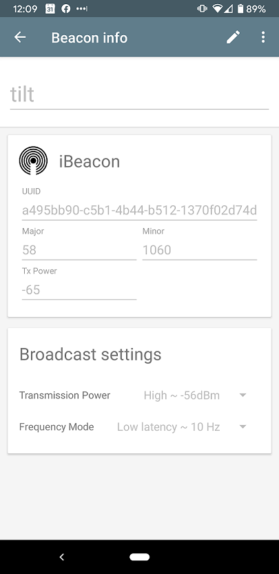

Tilty
=====

[](https://coveralls.io/github/myoung34/tilty)
[](https://hub.docker.com/r/myoung34/tilty)


A CLI to capture and emit events from your [tilt hydrometer](https://tilthydrometer.com/)

I've been unhappy with the quality/inconsistency of what I've seen out there in terms of random scripts that capture.
No tests, no pluggable emitters, hard to find, etc.

The tilt essentially broadcasts iBeacon packets to send out a uuid (which type of tilt it is), a major (the temp in F), and a minor (the specific gravity).

This will capture those whenever theyre transmitted and emit them to a backend of your choosing so that you can graph it over time asynchronously.

The Tilt supports writing to a google doc which you could use with something like IFTTT or Zapier, but this is much lighter and lets you decide how you want to push that out with a pluggable backend system.


## Supported Emitters ##

* stdout
* Webhooks
  * Generic (Send to any endpoint with any type)
  * Brewstat.us (Example below)
  * BrewersFriend (Example below)
* InfluxDB (1.8+)
* Datadog (dogstatsd)
* SQLite

## Usage ##

### Generate Config ###

```
$ cat <<EOF >config.toml
[general]
sleep_interval = 2 # defaults to 1
gravity_offset = -0.001 # subtract 0.001 gravity
temperature_offset = 3 # add 3 degrees
logging_level = DEBUG # defaults to INFO
logfile = /var/log/foo.log # defaults to stdout

# stdout example
[stdout]

# SQLite example
[sqlite]
enabled = true
file = /etc/tilty/tilt.sqlite

# Generic application/json example
[webhook]
enabled = true
url = "http://www.foo.com"
headers = "{\"Content-Type\": \"application/json\"}"
template = "{\"color\": \"{{.Color}}\", \"gravity\": {{.Gravity}}, \"mac\": \"{{.Mac}}\", \"temp\": {{.Temp}}, \"timestamp\": \"{{.Timestamp}}\", \"gravity_unit\": \"G\", \"temp_unit\": \"F\"}"
method = "POST"

# Brewstat.us example
[webhook]
enabled = true
url = "https://www.brewstat.us/tilt/0yjRbGd2/log"
headers = "{\"Content-Type\": \"application/json\"}"
template = "{\"Color\": \"{{.Color}}\", \"SG\": {{.Gravity}}, \"Temp\": {{.Temp}}, \"Timepoint\": \"{{.Timestamp}}\"}"
method = "POST"

# Brewers Friend example
[webhook]
enabled = true
url = "https://log.brewersfriend.com/tilt/3009ec67c6d81276185c90824951bd32bg"
headers = "{\"Content-Type\": \"application/json\"}"
template = "{\"SG\": \"{{.Gravity}}\", \"Temp\": {{.Temp}}, \"Color\": {{.Color}}}"
method = "POST"

# Brewfather custom stream example
[webhook]
enabled = true
url = "https://log.brewfather.net/stream?id=aTHF9WlXKrAb1C"
headers = "{\"Content-Type\": \"application/json\"}"
template = "{\"name\": \"Tilt {{.Color}}\", \"gravity\": {{.Gravity}}, \"gravity_unit\": \"G\", \"temp\": {{.Temp}}, \"temp_unit\": \"F\"}"
method = "POST"

[datadog]
enabled = true
# Note: make sure that the dd agent has DD_DOGSTATSD_NON_LOCAL_TRAFFIC=true
statsd_host = "statsdhost.corp.com"
statsd_port = 8125

[influxdb]
url = "http://localhost:8086"
verify_ssl = true
bucket = "tilty"
org = "Mine"
token = "myuser:password"
gravity_payload_template = "gravity,color={{.Color}},mac={{.Mac}} sg={{.Gravity}}"
temperature_payload_template = "temperature,color={{.Color}},mac={{.Mac}} temp={{.Temp}}"

```

### Run ###

```
$ tilty
$ # Or from docker ( generate config into $cwd/config/config.toml )
$ docker run -it \
  -v $(pwd)/config:/etc/tilty \
  --privileged \
  --net=host \
  myoung34/tilty:latest \
  -r --config-file /etc/tilty/config.toml
```

### Functional Development ###

To test locally (and without using my tilty): I use iBeacon on android and set:

* UUID to one of the ones listed in [here](tilty/constants.py)
* Major to a temperature in F
* Minor to an SG*1000


