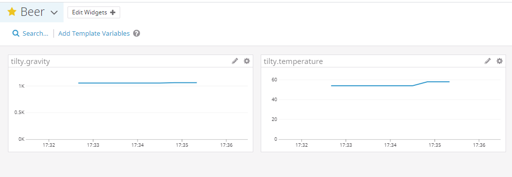

Tilty
=====

[](https://coveralls.io/github/myoung34/tilty)
[](https://pypi.python.org/pypi/Tilty/)
[](https://hub.docker.com/r/myoung34/tilty)



A python module and CLI to capture and emit events from your [tilt hydrometer](https://tilthydrometer.com/)

I've been unhappy with the quality/inconsistency of what I've seen out there in terms of random scripts that capture.
No tests, no pluggable emitters, hard to find, etc.

The tilt essentially broadcasts iBeacon packets to send out a uuid (which type of tilt it is), a major (the temp in F), and a minor (the specific gravity).

This will capture those whenever theyre transmitted and emit them to a backend of your choosing so that you can graph it over time asynchronously.

The Tilt supports writing to a google doc which you could use with something like IFTTT or Zapier, but this is much lighter and lets you decide how you want to push that out with a pluggable backend system.


## Supported Emitters ##


* Webhooks
* InfluxDB
* Datadog (dogstatsd)


## Usage ##

### Generate Config ###

```
$ cat <<EOF >config.ini
[general]
sleep_interval = 1

# Generic application/json example
[webhook]
url = http://www.foo.com
headers = {"Content-Type": "application/json"}
payload_template = {"color": "{{ color }}", "gravity": {{ gravity }}, "temp": {{ temp }}, "timestamp": "{{ timestamp }}"}
method = POST

# Brewstat.us example
[webhook]
url = https://www.brewstat.us/tilt/0yjRbGd2/log
headers = {"Content-Type": "application/x-www-form-urlencoded; charset=utf-8"}
payload_template = {"Color": "{{ color }}", "SG": {{ gravity }}, "Temp": {{ temp }}, "Timepoint": "{{ timestamp }}"}
method = POST

[influxdb]
url = influxdb.corp.com
port = 80
database = tilty
gravity_payload_template = {"measurement": "gravity", "tags": {"color": "{{ color }}"}, "fields": {"value": {{ gravity }}}}
temperature_payload_template = {"measurement": "temperature", "tags": {"color": "{{ color }}"}, "fields": {"value": {{ temp }}}}

[datadog]
# Note: make sure that the dd agent has DD_DOGSTATSD_NON_LOCAL_TRAFFIC=true
host = statsdhost.corp.com
port = 8125
EOF
```

### Run ###

```
$ tilty
$ # Or from docker ( generate config into $cwd/config/config.ini )
$ docker run -it \
  -v $(pwd)/config:/etc/tilty \
  --net=host \
  myoung34/tilty:latest \
  -r --config-file /etc/tilty/config.ini
```

## Installation ##

```
$ git clone https://github.com/myoung34/tilty
$ pip install -e .
```

## Development ##

```
$ docker run -it -v $(pwd):/src -w /src --entrypoint /bin/sh python:3.7-alpine
$ apk add -U openssl-dev alpine-sdk libffi-dev python3-dev py3-bluez bluez-dev
$ pip3 install poetry
$ poetry install
$ poetry run tox
```

### Functional Development ###

To test locally (and without using my tilty): I use iBeacon on android and set:

* UUID to one of the ones listed in [here](tilty/constants.py)
* Major to a temperature in F
* Minor to an SG*1000


